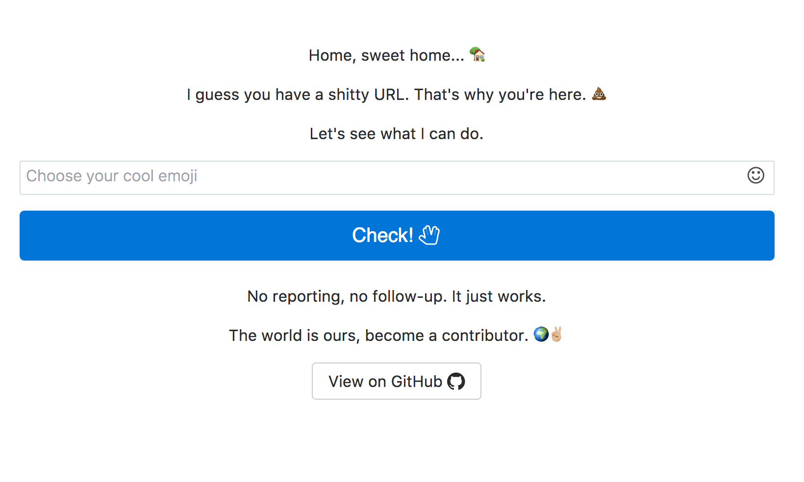

### Shitty url shortener, emoji powered.

* [🌍✌🏼.ws](http://🌍✌🏼.ws)
* [👎👍.ws](http://👎👍.ws/)



**Deploy your own shitty url shortener.**

Shitty, works well in heroku environment.
It requires NodeJS and MongoDB.

[](https://heroku.com/deploy?template=https://github.com/cagataycali/url-shortener)

**Usage In Command Line Interface**

*Install*

```
npm i -g url-shortener;
```

*Usage*

```
shorten https://github.com 👎👍
```

**Usage In Programmatic API**

*Install*

```
npm i -S url-shortener
```

*Usage*
```javascript
const Shortener = require('url-shortener');

const shorten = new Shortener();
shorten.pick({url: 'https://github.com/', emoji: '👎👍'})
  .then(response => console.log(response))
  .catch(error => console.log(error))
```
